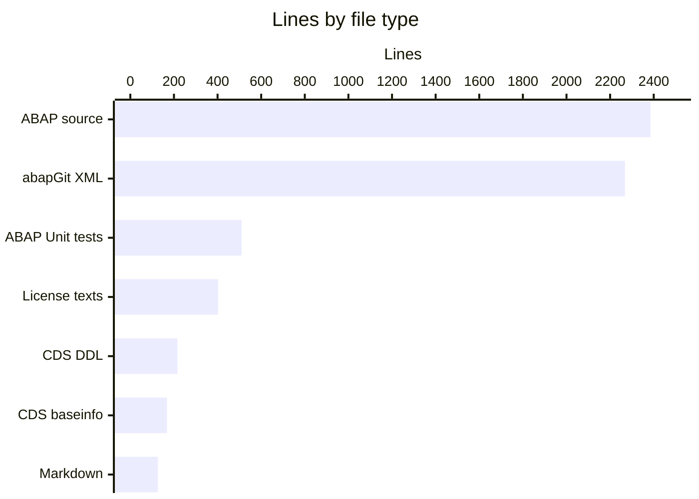
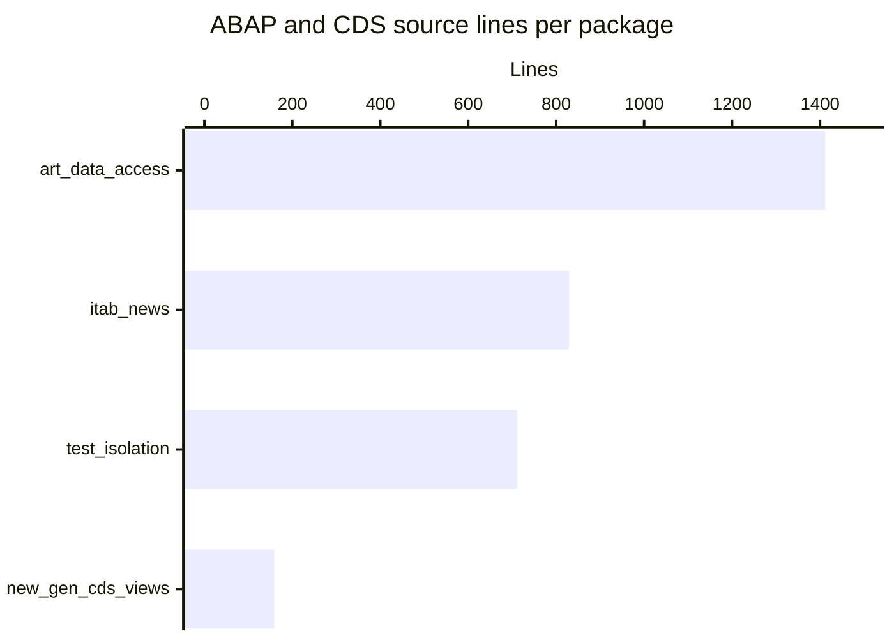
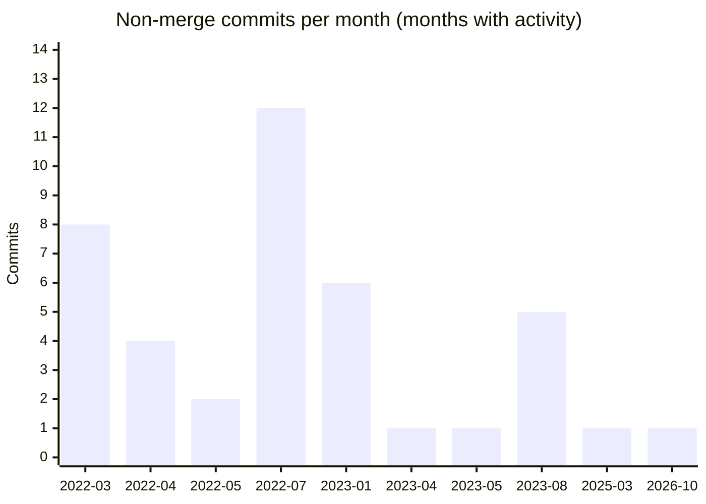

# By the numbers

Data collected on 4 Oct 2026 from the `main` branch at commit `97f93ef`.

## Size

The repository has 140 tracked files. Half of them are abapGit XML metadata that accompanies the hand-written ABAP and CDS sources.

| File type | Files | Lines |
| --- | --- | --- |
| ABAP source (`.abap`, excluding test include) | 46 | 2,385 |
| ABAP Unit test include (`.clas.testclasses.abap`) | 1 | 510 |
| CDS DDL (`.asddls`) | 9 | 216 |
| abapGit XML metadata (`.xml`) | 70 | 2,268 |
| CDS dependency info (`.baseinfo`, JSON) | 9 | 168 |
| Markdown (`.md`) | 2 | 127 |
| License and REUSE files | 3 | 413 |

### Per package

| Package | Files | ABAP + CDS source files | Source lines | Avg lines per source file |
| --- | --- | --- | --- | --- |
| `src/art_data_access/` | 71 | 31 | 1,412 | 45 |
| `src/itab_news/` | 27 | 11 | 829 | 75 |
| `src/test_isolation/` | 17 | 8 | 711 | 88 |
| `src/new_gen_cds_views/` | 19 | 6 | 159 | 26 |

### ABAP objects

| Object type | Count |
| --- | --- |
| Global classes | 32 |
| Executable programs | 9 |
| CDS data definitions | 9 |
| DDIC tables (transparent) | 7 |
| DDIC structures | 1 |
| Table types | 2 |
| Data elements | 2 |
| Interfaces | 2 |
| Packages | 5 (root plus 4 subpackages) |

### Largest source files

| File | Lines |
| --- | --- |
| `src/test_isolation/zati_cl_code_under_test.clas.testclasses.abap` | 510 |
| `src/itab_news/zdemo_itab_scnd_opt.prog.abap` | 204 |
| `src/art_data_access/ybw_load_data.clas.abap` | 192 |
| `src/itab_news/zdemo_itab_step.prog.abap` | 136 |
| `src/itab_news/zdemo_itab_any_like_ext.prog.abap` | 108 |

The smallest is `src/new_gen_cds_views/z_view_entity_extension.ddls.asddls` at 4 lines.

## Activity

`main` has 48 commits: 41 regular commits and 7 merge commits. 40 of the regular commits are upstream SAP history (Mar 2022 to Mar 2025); the remaining one is the Oct 2026 "Initial commit" stub from the hl-factory import.

| Year | Non-merge commits |
| --- | --- |
| 2022 | 26 |
| 2023 | 13 |
| 2025 | 1 |
| 2026 | 1 (import) |

Across all non-merge commits, about 7,575 lines were added and 1,166 deleted.

### Churn hotspots

In the last 90 days the only activity is the Oct 2026 import (one stub commit and one merge, with no net change to existing files). Over the full history, the most frequently changed paths are:

| Path | Commits touching it |
| --- | --- |
| `README.md` | 15 |
| .reuse/dep5 (removed Mar 2025) | 5 |
| `src/art_data_access/ybw_windowing_abap.clas.abap` | 4 |
| Each .ddls file in `src/new_gen_cds_views/` | 2 to 3 |

| Directory | File-level changes |
| --- | --- |
| `src/art_data_access/` | 111 |
| `src/new_gen_cds_views/` | 47 |
| `src/test_isolation/` | 46 |
| `src/itab_news/` | 27 |

## Bot-attributed commits

0 of 48 commits carry a `Co-authored-by:` trailer, and no commit author is a bot account (`[bot]` suffix). That is 0% bot-attributed. This is a lower bound on tool-assisted work, because inline assistants leave no trace in git history. Many commits were made through the GitHub web UI ("Add files via upload", "Update README.md"), which is a human workflow.

## Complexity

ABAP demo code here is flat: no package imports another, and the deepest call chain is three objects long (`YBW_TIPPS6` → `YBW_CANDIDATE_MANAGER` → local class `LIMPL_DBAPI` through `API_FACTORY`). Cross-object references within packages:

| From | To |
| --- | --- |
| `YBW_JOIN` | `YBW_INTERSECT=>EXECUTE_INTERSECT` |
| `YBW_WINDOWING4` | `YBW_WINDOWING_ABAP=>READ_VOTES_AGGREGATED` and its table type |
| `YBW_TIPPS6` | `YBW_CANDIDATE_MANAGER=>ADD_CANDIDATE` |
| `ZCL_DEMO_ITAB_KEY_ALIAS_2` | `ZCL_DEMO_ITAB_KEY_ALIAS_1=>TT_ITEM` |
| `ZDEMO_ITAB_SCND_OPT` | table type `ZDEMO_ITAB_ORDER_TAB` |
| `ZATI_CL_CODE_UNDER_TEST` | `ZATI_CL_FACTORY`, `ZATI_CDS_ENTITY` |

Public API per object is small. Most demo classes expose only `IF_OO_ADT_CLASSRUN~MAIN`; the largest interface, `ZATI_IF_CODE_UNDER_TEST`, has six methods.

## Per-package contributor count

| Package | Distinct human committers |
| --- | --- |
| `src/art_data_access/` | 1 |
| `src/itab_news/` | 1 |
| `src/new_gen_cds_views/` | 1 |
| `src/test_isolation/` | 1 |

Every package has a bus factor of one: the person who presented the session. Test-to-code ratio is 510 test lines to 2,601 non-test ABAP and CDS lines across the repo (about 0.2), and all of the test code is in `src/test_isolation/`.

## Related pages

- [Lore](lore.md) for the timeline behind these numbers
- [Architecture](overview/architecture.md)
