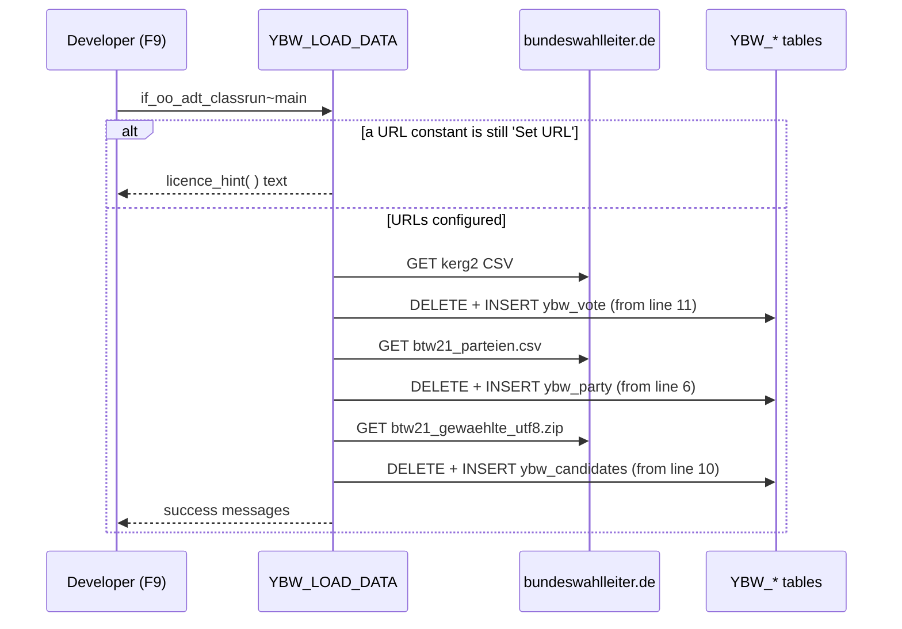

# Election dataset

Active contributors: Philipp Degler

## Purpose

The ABAP SQL demos in `src/art_data_access/` run against real data: results, parties, and elected candidates of the German federal election (Bundestagswahl) of 26 Sep 2021. SAP does not ship that data. Class `YBW_LOAD_DATA` (`src/art_data_access/ybw_load_data.clas.abap`) downloads the official open-data files from the Federal Returning Officer (Bundeswahlleiter) and inserts them into three DDIC tables. Until the loader has run, every demo that reads `YBW_*` tables returns empty results.

## Directory layout

```text
src/art_data_access/
├── ybw_load_data.clas.abap      # loader
├── ybw_vote.tabl.xml            # filled from kerg2 CSV
├── ybw_party.tabl.xml           # filled from btw21_parteien.csv
├── ybw_candidates.tabl.xml      # filled from btw21_gewaehlte_utf8.zip
├── ybw_votes_party.ddls.asddls  # view entity on ybw_vote
└── ybw_votes_person.ddls.asddls # view entity on ybw_vote
```

## Key abstractions

| Element | Location | Description |
| --- | --- | --- |
| `c_url_votes_csv` | `src/art_data_access/ybw_load_data.clas.abap` | Set to `https://www.bundeswahlleiter.de/bundestagswahlen/2021/ergebnisse/opendata/daten/kerg2_00287.csv` |
| `c_url_parties_csv` | same | Placeholder `` `Set URL` ``; the original URL to `btw21_parteien.csv` is left in a comment |
| `c_url_candidates_zip` | same | Placeholder `` `Set URL` ``; the original URL to `btw21_gewaehlte_utf8.zip` is left in a comment |
| `licence_hint( )` | same | Text shown when URLs are not set; explains where to find current URLs and the "Data licence Germany, attribution, version 2.0" |
| `load_csw_via_url( )` | same | HTTP GET with `cl_http_client`; for ZIP files, extracts `btw21_gewaehlte-fortschreibung_utf8.csv` with `cl_abap_zip` and converts with `cl_abap_conv_in_ce` |
| `load_votes( )`, `load_parties( )`, `load_candidates( )` | same | Delete table contents, split CSV on newline and `;`, insert row by row, `COMMIT WORK` |

## How it works



### Column mapping

The loader skips header lines and maps CSV columns by position. If the Bundeswahlleiter changes the file layout, these indexes are what need updating.

| Target table | Skips to line | Mapping (CSV column number) |
| --- | --- | --- |
| `YBW_VOTE` | 11 | `area` 5, `kind` 8, `party` 9, `subid` 10, `vote` 11, `votes` 12 |
| `YBW_PARTY` | 6 | `id` 1, `kind` 3, `short_name` 4, `long_name` 5 |
| `YBW_CANDIDATES` | 10 | `voting_date` 2 (reformatted from `DD.MM.YYYY` to `YYYYMMDD`), `title` 3, `addition` 4, `lastname` 5, `firstname` 6, `gender` 8, `birthyear` 9, `postcode` 10, `residence` 11, `birthplace` 14, `profession` 15, `profession_key` 16, `area_code` 19, `area_name` 20, `party` 22 |

### Views on the vote table

`YBW_VOTE` stores votes for both parties and individual candidates. Two view entities split it:

- `YBW_VOTES_PARTY` (`src/art_data_access/ybw_votes_party.ddls.asddls`): `where kind = 'Partei'`.
- `YBW_VOTES_PERSON` (`src/art_data_access/ybw_votes_person.ddls.asddls`): `where kind = 'Einzelbewerber/Wählergruppe' and party <> 'Einzelbewerber/Wählergruppe'`.

Rows that match neither, such as totals, are what `YBW_EXCEPT` isolates in its second query.

### Who uses the data

| Table or view | Used by |
| --- | --- |
| `YBW_VOTE` | `YBW_JOIN`, `YBW_INTERSECT`, `YBW_EXCEPT`, `YBW_CTE` |
| `YBW_PARTY` | `YBW_JOIN`, `YBW_INTERSECT`, `YBW_CTE`, `YBW_TIPPS2` to `YBW_TIPPS5`, `YBW_WINDOWING0` |
| `YBW_CANDIDATES` | `YBW_TIPPS1` to `YBW_TIPPS3`, `YBW_TIPPS6`, `YBW_WINDOWING1` to `YBW_WINDOWING3`, `YBW_CANDIDATE_MANAGER` |
| `YBW_VOTES_PARTY` | `YBW_UNION`, `YBW_EXCEPT`, `YBW_WINDOWING4`, `YBW_WINDOWING_ABAP` |
| `YBW_VOTES_PERSON` | `YBW_UNION`, `YBW_EXCEPT`, `YBW_TIPPS0` |

`YBW_INFRA` ("Structural data of germany", 26 fields such as `VOTE_AREA`, `POPULATION_ALL`, and school-leaver percentages) has no loader. It is only used as a target type in `YBW_TIPPS5`. The char-to-numc tables (`YDEMOS4_*`) also have no loader.

## Integration points

- Needs outbound HTTPS from the ABAP system to `www.bundeswahlleiter.de` and a working SSL client setup for `cl_http_client=>create_by_url`.
- Writes only to `YBW_VOTE`, `YBW_PARTY`, `YBW_CANDIDATES`. Each load deletes the previous contents first.
- `YBW_TIPPS4` and `YBW_TIPPS6` (through `YBW_CANDIDATE_MANAGER`) write extra rows into `YBW_PARTY` and `YBW_CANDIDATES`. Re-run the loader to reset.

## Key source files

| File | Purpose |
| --- | --- |
| `src/art_data_access/ybw_load_data.clas.abap` | Download, parse, insert |
| `src/art_data_access/ybw_vote.tabl.xml` | Vote results table |
| `src/art_data_access/ybw_party.tabl.xml` | Party table |
| `src/art_data_access/ybw_candidates.tabl.xml` | Elected candidates table |
| `src/art_data_access/ybw_votes_party.ddls.asddls` | Party vote view |
| `src/art_data_access/ybw_votes_person.ddls.asddls` | Person vote view |

## Entry points for modification

To get data, open `src/art_data_access/ybw_load_data.clas.abap`, replace the two `` `Set URL` `` values (and the votes URL if it has moved) with current links from `https://www.bundeswahlleiter.de/bundestagswahlen/2021/ergebnisse/opendata.html`, activate, and run with F9. Do not commit the changed URLs back if they are as unstable as the licence hint warns. Field layouts are documented in [Data models](../reference/data-models.md); common load failures are in [Debugging](../how-to-contribute/debugging.md).

## Related pages

- [Art of data access](../packages/art-data-access.md)
- [Configuration](../reference/configuration.md)
