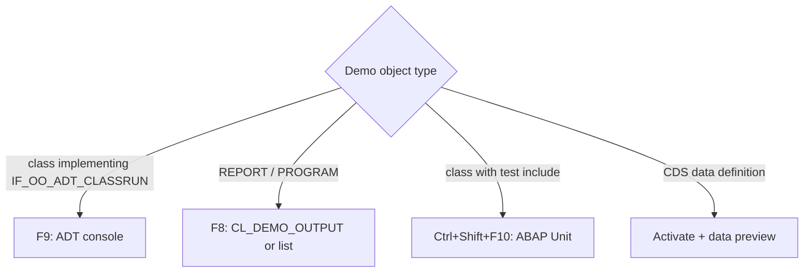

# Running demos

Active contributors: Philipp Degler, Andre Fischer, Michael Sauter

## Purpose

The repository has no entry point. Each demo object runs on its own inside ADT, and the way you start it depends on its type. This page explains the four execution styles used across the packages and what output to expect from each.

## Execution styles

| Style | Used in | How to start | Output |
| --- | --- | --- | --- |
| ADT class runner | `src/art_data_access/` (all `YBW_*` classes except `YBW_CANDIDATE_MANAGER`) | Open the class, press F9 | Text and tables in the ADT console via `out->write( )` |
| Executable program | `src/itab_news/` (`ZDEMO_ITAB_*` programs) | Open the program, press F8 | `CL_DEMO_OUTPUT` window or classic list (`WRITE`) |
| ABAP Unit | `src/test_isolation/` | Open `ZATI_CL_CODE_UNDER_TEST`, run unit tests (Ctrl+Shift+F10) | ABAP Unit result view |
| Data preview / activation | `src/new_gen_cds_views/`, plus the CDS views in other packages | Activate the DDL source; open data preview (F8) on an entity | Syntax check messages and preview grid |

## ADT class runner

Classes implement `if_oo_adt_classrun` and put all logic in `if_oo_adt_classrun~main`, which receives an `out` object. Every runnable class in `src/art_data_access/` carries the ABAP Doc line "Please execute the class in the eclipse editor aka. ADT with shortcut F9. The result will be displayed in the console." `README.md` adds: "Just load the source code of the class with STRG+A" before pressing F9.

Exceptions:

- `YBW_TIPPS4` writes to `YBW_PARTY` and prints nothing.
- `YBW_TIPPS6` displays its result with `cl_demo_output=>display( )` and is expected to dump with `DBSQL_INVALID_CURSOR` (see [Debugging](../how-to-contribute/debugging.md)).
- `YBW_JOIN` and `YBW_WINDOWING4` end with an `assert` against another class's result; if the data or the reference query changes, they dump instead of printing.

## Executable programs

The `src/itab_news/` programs are classic reports. They create their own data, so they work without any setup.

- Most use `data(out) = cl_demo_output=>new( )`, write sections, and call `out->display( )`.
- `ZDEMO_ITAB_STEP` shows a selection screen first. Pick an operation (`LOOP`, `DELETE`, `INSERT`, `APPEND`, `FOR`, `LINES OF`) and set line count, step, from, and to.
- `ZDEMO_ITAB_SCND_OPT` has a `rep_cnt` parameter (default 1) and prints run times with `WRITE`.
- `ZDEMO_ITAB_STEP_SYNTAX` and `ZDEMO_ITAB_ANY_LIKE` produce no visible output; they are syntax references and assertion checks.

## ABAP Unit

Only `src/test_isolation/zati_cl_code_under_test.clas.testclasses.abap` contains tests. Running them executes eight test classes. A test that does not isolate `ZATI_CL_DEPENDED_ON_COMPONENT` fails immediately, because its `add( )` is `assert 1 = 0`. See [Testing](../how-to-contribute/testing.md).

## CDS sources

The CDS demos are mostly about what the syntax check accepts. Activating `src/new_gen_cds_views/z_demo_no_1.ddls.asddls` shows which expressions a view entity allows; uncommenting lines in `src/new_gen_cds_views/z_classic_view.ddls.asddls` shows the errors the DDIC-based view raises. Data preview on `Z_DEMO_NO_1` asks for the three parameters.

## Integration points

- Output helpers: `IF_OO_ADT_CLASSRUN`, `CL_DEMO_OUTPUT`.
- Data prerequisites: [Election dataset](election-dataset.md) for `YBW_*` demos; SAP flight and demo tables for CDS and test isolation.

## Entry points for modification

When adding a demo, pick the execution style that matches its package so readers do not need new instructions: a class runner for SQL demos, a report for internal table demos, a test class for isolation techniques.

## Related pages

- [Getting started](../overview/getting-started.md)
- [Packages](../packages/index.md)
