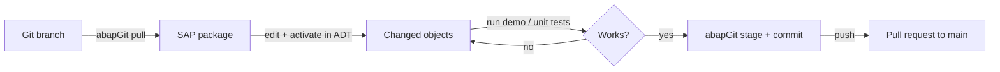

# Development workflow

ABAP code lives in the SAP system's repository, not on disk. The files in `src/` are abapGit's serialization of those objects. The development loop is therefore: pull into a system, edit and activate there, then push the serialized result back to Git.

## The cycle

1. **Branch.** Create a branch in Git (`git checkout -b my-change`).
2. **Link and pull.** In abapGit, link the repository to your root package (11 characters or fewer, see [Getting started](../overview/getting-started.md)), switch to your branch, and pull.
3. **Edit in ADT.** Change classes, programs, CDS sources, or DDIC objects in the SAP system. Activate.
4. **Verify.** Run the demo the way its package expects ([Running demos](../features/running-demos.md)). For `src/test_isolation/`, run ABAP Unit.
5. **Stage and commit with abapGit.** abapGit regenerates the `.abap`, `.asddls`, and `.xml` files. Check that it stages the XML metadata along with the source.
6. **Push and open a pull request** against `main`.

## Editing files directly in Git

Some upstream commits edited files directly on GitHub (for example five "Update z_*.ddls.asddls" commits on 13 Jan 2023). That works for small source changes, but:

- Activation errors only show up after the next abapGit pull.
- Missing metadata is easy to miss. The Jan 2023 upload left `.ddls.xml` files without content and `src/new_gen_cds_views/package.devc.xml` empty; the XML was re-uploaded in May 2023, but the package file is still empty. See [Lore](../lore.md).

Edit in an SAP system when you can, and treat direct Git edits as documentation-only changes (`README.md`).

## Renaming objects

The Aug 2023 commit "Change prefix from personal to generic" renamed every `ZMS*` object in `src/test_isolation/` to `ZATI_*`. In abapGit, a rename is a delete plus a create: all files are replaced, and references (such as `global friends`) must be updated in the same change. Git records it as a mix of renames and new files.

## Documentation

`README.md` is ignored by abapGit (listed under `IGNORE` in `.abapgit.xml`), so edit it directly in Git. It is the main user-facing documentation and should list every runnable object per session.

## Related pages

- [Tooling](tooling.md)
- [Patterns and conventions](patterns-and-conventions.md)
- [Testing](testing.md)
