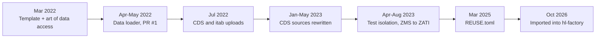

# Lore

How this repository came to be, reconstructed from the `main` branch history and the upstream branches that are still available locally. Upstream development ran from Mar 2022 to Mar 2025 under `SAP-samples/abap-platform-fundamentals-01`; the repository was later moved to `SAP-archive`, and it was imported into `hl-factory/HL-ABAP-system` in Oct 2026.

## Timeline

## Eras

### 1. The template (Mar 2022)

On 14 Mar 2022 Brian Bernard created the repository with SAP's standard sample template: `README.md`, `LICENSE`, `LICENSES/Apache-2.0.txt`, and .reuse/dep5. The next day Andre Fischer replaced the template text in `README.md` and filled in the REUSE metadata. The `README.md` comment that tells you to "Register repository https://api.reuse.software/register, then add REUSE badge" is still there from the template.

### 2. The art of data access (Mar to May 2022)

Philipp Degler built the first package on the branch `DSAG_TheArtOfDataAccess`:

- **30 Mar 2022:** "Initial set of samples for Art Of Data Access talk", 49 files, including `.abapgit.xml`, the `YBW_*` tables, `YBW_CANDIDATE_MANAGER`, and the two vote views. "add further objects" followed the same day.
- **31 Mar 2022:** "further updates" (18 files).
- **26 Apr 2022:** "add examples from the part 1 of the session" (37 files), bringing in the set operation, tip, windowing, and char-to-numc classes.
- **27 Apr 2022:** "Add program to load data into the tables" added `src/art_data_access/ybw_load_data.clas.abap`; "Update examples to fit dataset" adjusted `YBW_CTE`, `YBW_INTERSECT`, `YBW_JOIN`, and `YBW_UNION` to the real election data; and the README gained the session lists.
- **6 May 2022:** Andre Fischer merged pull request #1.

Around the same time Brian Bernard updated .reuse/dep5 (19 May) and Ajinkya Patil fixed the README in pull request #2 (20 May).

### 3. The summer of uploads (Jul 2022)

Andre Fischer added two more packages through the GitHub "Add files via upload" feature.

- **6 Jul 2022:** `src/new_gen_cds_views/` arrived with 15 files. Only `Z_CLASSIC_VIEW` and `Z_VIEW_EXTENSION` had content; the four view entity sources were 0-byte files. The README got its CDS section, and pull request #4 from schlotthauea fixed a README detail.
- **9 Jul 2022:** a src/REST_JSON/readme.md placeholder was created and deleted about 30 minutes later. No REST or JSON demo ever followed.
- **28 Jul 2022:** `src/itab_news/` was uploaded (nine programs, two classes, three DDIC objects). A placeholder folder src/ITAB_NEWS/ in upper case was created and deleted within a minute before the lower-case folder took its place. The package was never added to the top-level README.

### 4. The CDS rewrite (Jan to May 2023)

- **13 Jan 2023:** another upload turned almost every file in `src/new_gen_cds_views/` into a 0-byte file and removed `Z_CLASSIC_VIEW` and `Z_VIEW_EXTENSION` content. The same day, five web edits ("Update z_demo_no_1.ddls.asddls" and so on) filled in the view entity sources, which is the first time `Z_DEMO_NO_1`, `Z_VIEW_ENTITY_EXTENSION`, `Z_DEMO_ENTITY_BUFFER`, and `Z_DEMO_CALCULATED_QUANTITY` had real source in Git.
- **23 May 2023:** a final upload restored `Z_CLASSIC_VIEW` and all the `.ddls.xml` and `.ddls.baseinfo` files. `src/new_gen_cds_views/package.devc.xml` stayed empty and still is.

### 5. Test isolation (Apr to Aug 2023)

- **20 Apr 2023:** Michael Sauter added "Why don't these tests run?"-demo content: 21 files in `src/test_isolation/` using a personal `ZMS` prefix (`ZMSCL_CODE_UNDER_TEST`, `ZMSIF_*`, `ZMSTH_INJECTOR`, `ZMS_CDS_ENTITY`), plus a second code-under-test class, `ZMSCL_INTERNAL_INCIDENT`. Safa Golrokh Bahoosh merged it as pull request #6 on 11 May 2023.
- **18 Aug 2023:** "Change prefix from personal to generic" renamed everything to `ZATI_*`, removed `ZMSCL_INTERNAL_INCIDENT`, and switched the code from upper-case to lower-case keywords. The README section was rewritten the same day (four commits), including the test class table and a link to the global user group recording. Pull request #9 was merged on 21 Aug 2023.

### 6. Maintenance (Mar 2025)

- **7 Mar 2025:** Ajinkya Patil (committing as ajinkyapatil8190) replaced .reuse/dep5 with `REUSE.toml` on the branch `Reuse-Migration-TOML-Branch`, following the REUSE specification's move to TOML. He merged it as pull request #11 on 10 Mar 2025. This is the last upstream commit.

At some point after that, the repository moved from `SAP-samples` to `SAP-archive`. The history does not record when.

### 7. Import into hl-factory (Oct 2026)

On 4 Oct 2026 the upstream history was imported into `hl-factory/HL-ABAP-system`. GitHub's "Initial commit" stub (a one-line `README.md` reading `# HL-ABAP-system`) was merged with the upstream `main` in "Merge initial HL-ABAP-system commit", keeping the upstream `README.md` unchanged. These two commits are an import artifact, not development.

## Branches

All three upstream branches are fully merged into `main` and have no extra commits:

| Branch | Last commit | Purpose |
| --- | --- | --- |
| `DSAG_TheArtOfDataAccess` | 27 Apr 2022, "Update README.md" | Development of `src/art_data_access/` (PR #1) |
| `ajinkyapatil8190-patch-1` | 20 May 2022, "Update README.md" | README fix (PR #2) |
| `Reuse-Migration-TOML-Branch` | 7 Mar 2025, "Reuse Version update from dep to toml" | REUSE migration (PR #11) |

Merged pull request numbers on `main` are #1, #2, #4, #6, #9, and #11. The missing numbers were presumably issues or pull requests that were closed without merging.

## Longest-standing code

- `LICENSE` and `LICENSES/Apache-2.0.txt` are unchanged since 14 Mar 2022.
- `.abapgit.xml`, `YBW_CANDIDATE_MANAGER` (all four source parts), `YBW_VOTES_PARTY`, and `YBW_VOTES_PERSON` are unchanged since the first art-of-data-access commit on 30 Mar 2022.
- `src/art_data_access/ybw_windowing_abap.clas.abap` is the most-edited ABAP file, with 4 commits, all in Mar and Apr 2022.

## Deprecated and removed

| What | Introduced | Removed | Notes |
| --- | --- | --- | --- |
| src/REST_JSON/ placeholder | 9 Jul 2022 | 9 Jul 2022 | Hints at a planned REST/JSON session that never shipped |
| `ZMS*` test isolation objects | 20 Apr 2023 | 18 Aug 2023 | Replaced by `ZATI_*` equivalents |
| `ZMSCL_INTERNAL_INCIDENT` | 20 Apr 2023 | 18 Aug 2023 | A second code-under-test class with its own tests. Its `call_function_module` mapped answer `'A'` to `2`. Dropped without a replacement. |
| .reuse/dep5 | 14 Mar 2022 | 7 Mar 2025 | Replaced by `REUSE.toml` |
| Planned RAP sessions | `README.md` | Never added | "ABAP RESTful Application Programming Model - Fundamentals (planned)" and "- Entity Manipulation Language (planned)" are still listed |

## Growth

Upstream had 40 non-merge commits from 7 committer identities, which are 6 people once Ajinkya Patil's two identities are counted together. Safa Golrokh Bahoosh, the supplier contact in `REUSE.toml`, appears only as the merger of pull requests #6 and #9. Each package came from one person who presented the matching session:

| Package | Author | Added |
| --- | --- | --- |
| `src/art_data_access/` | Philipp Degler | Mar to Apr 2022 |
| `src/new_gen_cds_views/` | Andre Fischer | Jul 2022 to May 2023 |
| `src/itab_news/` | Andre Fischer | Jul 2022 |
| `src/test_isolation/` | Michael Sauter | Apr to Aug 2023 |

Activity peaked in Jul 2022 (12 commits) and stopped after Aug 2023, apart from the 2025 license metadata change.

## Related pages

- [By the numbers](by-the-numbers.md)
- [Fun facts](fun-facts.md)
- [Packages](packages/index.md)
