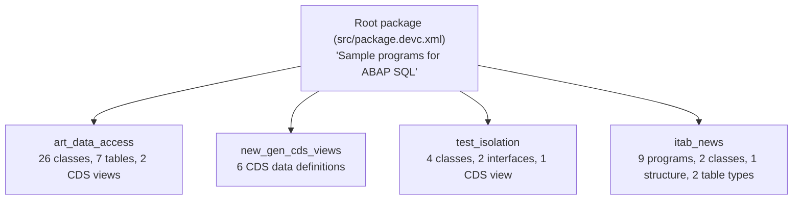
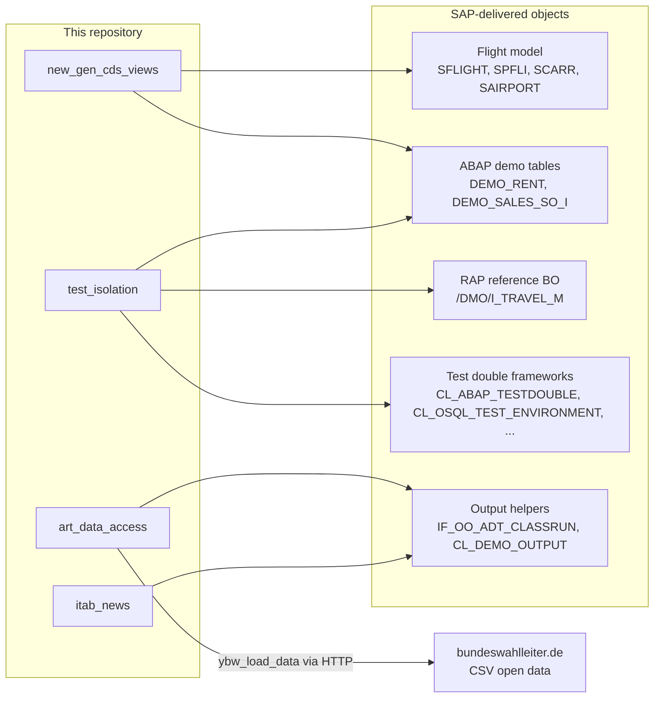
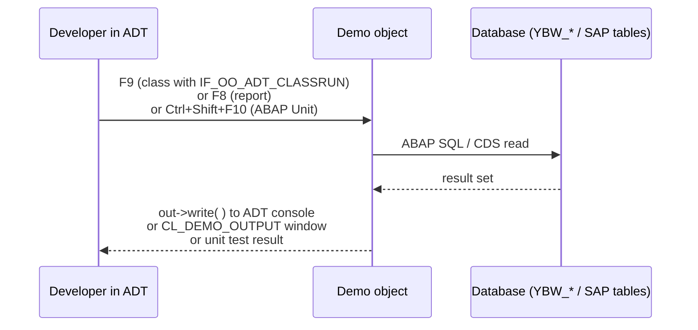
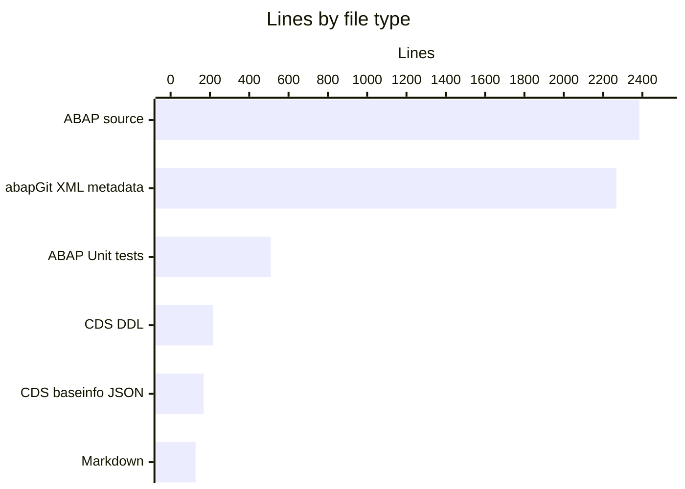

# Architecture

The repository is a set of independent ABAP demo packages serialized by abapGit. Nothing here runs on its own: abapGit deserializes the files into repository objects in an SAP system, and you run each demo from ABAP Development Tools (ADT). This page explains how the files map to ABAP objects, how the packages relate to each other, and which SAP-delivered objects they depend on.

## From files to ABAP objects

`.abapgit.xml` at the repository root controls deserialization:

- `STARTING_FOLDER` is `/src/`, so only files under `src/` become ABAP objects.
- `FOLDER_LOGIC` is `PREFIX`. Each subfolder becomes a subpackage whose name is the root package name plus the folder name. If you import into `Z_DSAG01`, `src/test_isolation/` becomes `Z_DSAG01_TEST_ISOLATION`. This is why `README.md` limits the root package name to 11 characters.
- `MASTER_LANGUAGE` is `E` (English).
- `README.md`, `LICENSE`, and a list of CI/tooling files are ignored.

Each ABAP object is stored as one or more files named `<object>.<type>.<part>`:

| Suffix | ABAP object type | Example |
| --- | --- | --- |
| `.clas.abap` + `.clas.xml` | Global class (source + metadata) | `src/art_data_access/ybw_join.clas.abap` |
| `.clas.locals_def.abap`, `.clas.locals_imp.abap`, `.clas.macros.abap` | Class-local types, local classes, macros | `src/art_data_access/ybw_candidate_manager.clas.locals_imp.abap` |
| `.clas.testclasses.abap` | ABAP Unit test classes of a global class | `src/test_isolation/zati_cl_code_under_test.clas.testclasses.abap` |
| `.intf.abap` + `.intf.xml` | Global interface | `src/test_isolation/zati_if_code_under_test.intf.abap` |
| `.prog.abap` + `.prog.xml` | Executable program (report) with text elements | `src/itab_news/zdemo_itab_step.prog.abap` |
| `.ddls.asddls` + `.ddls.xml` + `.ddls.baseinfo` | CDS data definition (source, metadata, dependency info) | `src/new_gen_cds_views/z_demo_no_1.ddls.asddls` |
| `.tabl.xml` | DDIC database table or structure | `src/art_data_access/ybw_vote.tabl.xml` |
| `.ttyp.xml` | DDIC table type | `src/itab_news/zdemo_itab_order_tab_opt.ttyp.xml` |
| `.dtel.xml` | DDIC data element | `src/art_data_access/ybw_d_party.dtel.xml` |
| `package.devc.xml` | Package definition | `src/test_isolation/package.devc.xml` |

## Package layout

The packages do not reference each other. Each one is a separate talk with its own data and its own SAP standard dependencies. Inside a package, demos often reference each other: for example `src/art_data_access/ybw_join.clas.abap` asserts that its result equals `ybw_intersect=>execute_intersect( )`.

## Dependencies on SAP-delivered objects

Most demos read from tables and frameworks that SAP ships with the ABAP platform. They are not in this repository, so the target system must have them.

See [Dependencies](../reference/dependencies.md) for the full list.

## How a demo runs

The demos use three execution styles. All of them print to a console or output window instead of building a UI.

Details are on [Running demos](../features/running-demos.md).

## Language breakdown

Counts are lines in tracked files at the current commit.

About half of the repository by line count is XML metadata that abapGit generates. The hand-written content is the ABAP and CDS source. See [By the numbers](../by-the-numbers.md) for more.

## Related pages

- [Packages](../packages/index.md) for a page per package
- [Patterns and conventions](../how-to-contribute/patterns-and-conventions.md) for naming and coding style
- [Configuration](../reference/configuration.md) for `.abapgit.xml` and `REUSE.toml`
