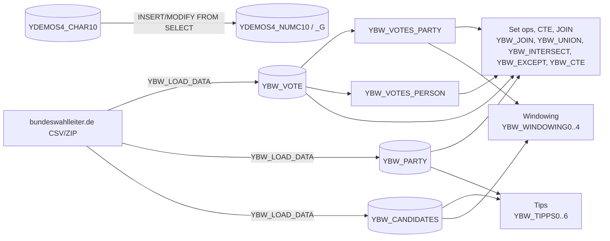

# Art of data access

Active contributors: Philipp Degler

## Purpose

`src/art_data_access/` holds the demos from the two-part session "ABAP SQL: the art of accessing data". Each demo is a class you run with F9 in ADT. Most of them query German federal election 2021 data stored in the `YBW_*` tables to show modern ABAP SQL features: set operations, common table expressions, window functions, `INSERT ... FROM SELECT`, and a set of practical tips. The package description in `src/art_data_access/package.devc.xml` is "The Art of data access".

This is the largest package: 71 files, 26 classes, 7 DDIC tables, 2 data elements, and 2 CDS view entities, about 1,400 lines of ABAP and CDS. All content was committed by one author between Mar and Apr 2022.

## Directory layout

```text
src/art_data_access/
├── package.devc.xml
├── ybw_load_data.clas.abap            # loads election CSV data from the web
├── ybw_vote.tabl.xml                  # election results
├── ybw_party.tabl.xml                 # parties (fully buffered)
├── ybw_candidates.tabl.xml            # elected candidates
├── ybw_infra.tabl.xml                 # structural data (target type in TIPPS5)
├── ybw_votes_party.ddls.asddls        # view entity: votes for parties
├── ybw_votes_person.ddls.asddls       # view entity: votes for individuals
├── ybw_d_area_name.dtel.xml, ybw_d_party.dtel.xml
├── ybw_join / union / intersect / except / cte .clas.abap    # session part 1
├── ybw_tipps0..3.clas.abap                                   # session part 1
├── ybw_windowing0..4.clas.abap, ybw_windowing_abap.clas.abap # session part 2
├── ybw_char_to_numc_1..6.clas.abap                           # session part 2
├── ybw_tipps4..6.clas.abap                                   # session part 2
├── ybw_candidate_manager.clas*.abap   # helper used by TIPPS6
└── ydemos4_char10 / numc10 / numc10_g .tabl.xml              # char-to-numc tables
```

## Key abstractions

| Object | File | Role |
| --- | --- | --- |
| `YBW_LOAD_DATA` | `src/art_data_access/ybw_load_data.clas.abap` | Downloads and parses the election CSV files into `YBW_VOTE`, `YBW_PARTY`, `YBW_CANDIDATES`. See [Election dataset](../features/election-dataset.md). |
| `YBW_VOTES_PARTY` | `src/art_data_access/ybw_votes_party.ddls.asddls` | View entity over `YBW_VOTE` where `kind = 'Partei'`. |
| `YBW_VOTES_PERSON` | `src/art_data_access/ybw_votes_person.ddls.asddls` | View entity over `YBW_VOTE` for individual candidates and voters' groups. |
| `YBW_INTERSECT=>EXECUTE_INTERSECT` | `src/art_data_access/ybw_intersect.clas.abap` | Static method reused by `YBW_JOIN` to prove the join gives the same result. |
| `YBW_WINDOWING_ABAP=>READ_VOTES_AGGREGATED` | `src/art_data_access/ybw_windowing_abap.clas.abap` | Classic two-query-plus-loop aggregation, used as the reference result for `YBW_WINDOWING4`. |
| `YBW_CANDIDATE_MANAGER=>ADD_CANDIDATE` | `src/art_data_access/ybw_candidate_manager.clas.abap` | Small API that inserts a candidate through a local interface and factory. Contains a hidden `WAIT` that `YBW_TIPPS6` uses as a bug. |

## How it works



### Session part 1: joins, set operations, CTEs

| Class | What it shows |
| --- | --- |
| `YBW_JOIN` (`src/art_data_access/ybw_join.clas.abap`) | `INNER JOIN` of `YBW_VOTE` and `YBW_PARTY` with all filters in the `ON` condition. Asserts the result equals `YBW_INTERSECT=>EXECUTE_INTERSECT( )`. |
| `YBW_UNION` (`src/art_data_access/ybw_union.clas.abap`) | `UNION ALL` of summed first votes per party (from `YBW_VOTES_PARTY`) and per person (from `YBW_VOTES_PERSON`), with a literal `'Partei'` / `'Person'` group column. Comments explain why `UNION ALL` is enough and usually faster than `UNION DISTINCT`. |
| `YBW_INTERSECT` (`src/art_data_access/ybw_intersect.clas.abap`) | Prints both input sets (parties with votes, real parties, both filtered to names starting with `P`) and then their `INTERSECT`. |
| `YBW_EXCEPT` (`src/art_data_access/ybw_except.clas.abap`) | `EXCEPT` to find persons with votes, then a chained `EXCEPT ... EXCEPT` to show left-to-right evaluation; only totals rows remain. |
| `YBW_CTE` (`src/art_data_access/ybw_cte.clas.abap`) | Combines the earlier queries as CTEs (`+vote`, `+party`, `+intersect`, `+join`) and computes the symmetric difference between the intersect and join results. The result is empty, and the comment invites the reader to find out why. |

### Session part 1 tips

| Class | What it shows |
| --- | --- |
| `YBW_TIPPS0` | Starting with `FROM` so ADT code completion works in the field list. |
| `YBW_TIPPS1` | Timing `SELECT SINGLE @abap_true` against a `SELECT ... UP TO 1 ROWS ... ENDSELECT` loop for existence checks, 100 iterations each, measured with `GET RUN TIME`. |
| `YBW_TIPPS2` | A `LEFT OUTER JOIN` with the `p~kind` filter in the `ON` condition versus in the `WHERE` clause, which turns it into an inner join in effect. |
| `YBW_TIPPS3` | `coalesce( p~long_name, '< None >' )` to replace `NULL` values that would otherwise show up as initial ABAP values. |

### Session part 2: window functions

| Class | What it shows |
| --- | --- |
| `YBW_WINDOWING0` | `count(*) over( )` compared with a CTE plus `CROSS JOIN`, then `row_number( ) over( )`. |
| `YBW_WINDOWING1` | `min( birthyear ) over( partition by party )` and partitioning by an expression (`2021 - birthyear`). |
| `YBW_WINDOWING2` | `row_number( ) over( order by ... )`, then with `partition by party`. |
| `YBW_WINDOWING3` | Frame specification `rows between 2 preceding and 2 following` for a moving average age. |
| `YBW_WINDOWING_ABAP` | The same aggregation as `YBW_WINDOWING4`, done the old way: two `SELECT`s and a `LOOP` with `READ TABLE`. |
| `YBW_WINDOWING4` | One `SELECT` with `sum( sum( votes ) ) over( partition by party )`, asserted equal to the `YBW_WINDOWING_ABAP` result. |

### Session part 2: CHAR to NUMC conversion

The six `YBW_CHAR_TO_NUMC_*` classes move data from `YDEMOS4_CHAR10` (`CHAR 10`) into `YDEMOS4_NUMC10` (`NUMC 10`) using different techniques:

| Class | Technique |
| --- | --- |
| `_1` | Read into an internal table, assign to a NUMC-typed table (ABAP conversion rules), `MODIFY ... FROM TABLE`. |
| `_2` | Clears the target. The plain `INSERT ... FROM ( SELECT ... )` line is commented out, presumably because it does not compile without a conversion. |
| `_3` | `INSERT ... FROM ( SELECT ... cast( f_char10 as numc( 10 ) ) )`. |
| `_4` | Adds `lpad( ltrim( f_char10, @space ), 10, '0' )` before the cast to strip spaces and add leading zeros. |
| `_5` | Same expression with `MODIFY ... FROM ( SELECT ... )`. |
| `_6` | Same expression into the global temporary table `YDEMOS4_NUMC10_G`. |

No loader exists for `YDEMOS4_CHAR10`, so you need to enter test rows yourself.

### Session part 2 tips

| Class | What it shows |
| --- | --- |
| `YBW_TIPPS4` | Single-row `MODIFY` versus `MODIFY ... FROM TABLE` on the fully buffered `YBW_PARTY`. The class has no output. |
| `YBW_TIPPS5` | Old-style `select * ... into corresponding fields of table` into a `YBW_INFRA` table. The comment says new syntax would turn warnings into errors: "Try what happens here". |
| `YBW_TIPPS6` | A deliberate `DBSQL_INVALID_CURSOR` puzzle. `OPEN CURSOR`, then `ADD_CANDIDATE`, then `FETCH`. The hidden `wait-for-db` macro in `src/art_data_access/ybw_candidate_manager.clas.macros.abap` runs `WAIT UP TO 1 SECONDS`, which triggers an implicit database commit and closes the cursor. The constant `asap` also starts with a Cyrillic `а`, so it does not match the `as%` search pattern. |

## Integration points

- Reads only its own tables and views; no SAP standard tables.
- `YBW_LOAD_DATA` makes outbound HTTP calls to `www.bundeswahlleiter.de`.
- Output goes to the ADT console through `if_oo_adt_classrun~main`'s `out` parameter, except `YBW_TIPPS6`, which uses `cl_demo_output=>display`.

## Key source files

| File | Purpose |
| --- | --- |
| `src/art_data_access/ybw_load_data.clas.abap` | Data loader; must be configured before any demo returns data |
| `src/art_data_access/ybw_cte.clas.abap` | The most compact summary of session part 1 |
| `src/art_data_access/ybw_windowing4.clas.abap` | Window function replacing the ABAP loop in `src/art_data_access/ybw_windowing_abap.clas.abap` |
| `src/art_data_access/ybw_tipps6.clas.abap` | Debugging puzzle with two hidden bugs |
| `src/art_data_access/ybw_candidate_manager.clas.locals_imp.abap` | Local API implementation hiding the `WAIT` |
| `src/art_data_access/ybw_votes_party.ddls.asddls` | View entity used by union, except, and windowing demos |
| `src/art_data_access/ybw_party.tabl.xml` | Buffered table with secondary index `SHO` on `KIND` |

## Entry points for modification

To add a demo, copy an existing class such as `src/art_data_access/ybw_union.clas.abap` (class and `.clas.xml`), rename it, and keep the ABAP Doc header and F9 instruction. Add it to the matching session list in `README.md`. If the demo needs new columns, change the table XML and the column mapping in `YBW_LOAD_DATA` together; see [Data models](../reference/data-models.md).

## Related pages

- [Election dataset](../features/election-dataset.md)
- [Running demos](../features/running-demos.md)
- [Pitfalls](../background/pitfalls.md) for the `'Partei'` / `'PARTEI'` inconsistency and data loading issues
