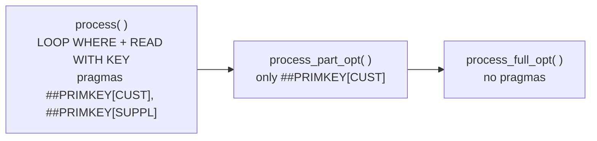

# Itab news

Active contributors: Andre Fischer

## Purpose

`src/itab_news/` contains demos of newer internal table features: generic (`ANY`-typed) table operands, key aliases, `LOOP AT ... GROUP BY`, the `STEP` addition, and secondary keys for performance. Its package description in `src/itab_news/package.devc.xml` is "DSAG Itab Demos". Several program titles end with "Alt gegen Neu" ("old versus new"), which sums up the approach: each demo puts the old way and the new way side by side.

The package was added in a single day in Jul 2022. It is not mentioned in the top-level `README.md`, and its own `src/itab_news/README.md` is a single blank line. It has 27 files: 9 executable programs, 2 classes, 1 DDIC structure, and 2 table types (829 lines of ABAP).

## Directory layout

```text
src/itab_news/
├── package.devc.xml
├── README.md                              # blank
├── zdemo_itab_any_like.prog.abap          # generic table operands (short)
├── zdemo_itab_any_like_ext.prog.abap      # generic table operands (extended)
├── zdemo_itab_key_alias.prog.abap         # key aliases (short)
├── zdemo_itab_key_alias_ext.prog.abap     # key aliases + RTTI
├── zcl_demo_itab_key_alias_1.clas.abap    # class with a secondary key k1
├── zcl_demo_itab_key_alias_2.clas.abap    # second class reusing that key
├── zdemo_itab_group_by.prog.abap          # AT END OF versus GROUP BY
├── zdemo_itab_group_by_sample.prog.abap   # GROUP BY with group size and index
├── zdemo_itab_step.prog.abap              # STEP with selection screen
├── zdemo_itab_step_syntax.prog.abap       # STEP syntax cheat sheet
├── zdemo_itab_scnd_opt.prog.abap          # secondary key performance exercise
├── zdemo_itab_order.tabl.xml              # structure for order rows
├── zdemo_itab_order_tab.ttyp.xml          # table type, no secondary key
└── zdemo_itab_order_tab_opt.ttyp.xml      # table type with secondary key CUST
```

## Key abstractions

| Object | File | Title (from `.prog.xml` / `.clas.xml`) |
| --- | --- | --- |
| `ZDEMO_ITAB_ANY_LIKE` | `src/itab_news/zdemo_itab_any_like.prog.abap` | Demo: ANY-LIKE Support |
| `ZDEMO_ITAB_ANY_LIKE_EXT` | `src/itab_news/zdemo_itab_any_like_ext.prog.abap` | Demo: ANY-LIKE Support |
| `ZDEMO_ITAB_KEY_ALIAS` | `src/itab_news/zdemo_itab_key_alias.prog.abap` | Demo: Secondary Key Alias |
| `ZDEMO_ITAB_KEY_ALIAS_EXT` | `src/itab_news/zdemo_itab_key_alias_ext.prog.abap` | Demo: Secondary Key Alias |
| `ZCL_DEMO_ITAB_KEY_ALIAS_1`, `_2` | `src/itab_news/zcl_demo_itab_key_alias_1.clas.abap`, `src/itab_news/zcl_demo_itab_key_alias_2.clas.abap` | Demo: Secondary Key Alias |
| `ZDEMO_ITAB_GROUP_BY` | `src/itab_news/zdemo_itab_group_by.prog.abap` | Demo: AT Versus. GROUP BY |
| `ZDEMO_ITAB_GROUP_BY_SAMPLE` | `src/itab_news/zdemo_itab_group_by_sample.prog.abap` | Demo: Group By |
| `ZDEMO_ITAB_STEP` | `src/itab_news/zdemo_itab_step.prog.abap` | Demo: Step |
| `ZDEMO_ITAB_STEP_SYNTAX` | `src/itab_news/zdemo_itab_step_syntax.prog.abap` | Demo: Step Syntax |
| `ZDEMO_ITAB_SCND_OPT` | `src/itab_news/zdemo_itab_scnd_opt.prog.abap` | Demo: Secondary Key Opt |
| `ZDEMO_ITAB_ORDER` | `src/itab_news/zdemo_itab_order.tabl.xml` | Structure: `ORDER`, `COUNT`, `SUPPL_ID`, `SUPPL_ITEM`, `CUSTOMER` (all `INT4`), `DESCRIPTION` (`CHAR 100`) |
| `ZDEMO_ITAB_ORDER_TAB` / `_OPT` | `src/itab_news/zdemo_itab_order_tab.ttyp.xml`, `src/itab_news/zdemo_itab_order_tab_opt.ttyp.xml` | Standard tables of `ZDEMO_ITAB_ORDER` with a non-unique primary key on `ORDER`; the `_OPT` type adds secondary key `CUST` on `CUSTOMER` |

## How it works

### Generic table operands (ANY-LIKE)

`ZDEMO_ITAB_ANY_LIKE` shows that `INSERT LINES OF <any> INTO TABLE ltr_int_any->*` works when the source is a field symbol typed `ANY` and the target is a `REF TO DATA` dereference, and asserts the result equals the statically typed version. `ZDEMO_ITAB_ANY_LIKE_EXT` extends this to a method parameter typed `any` passed to `APPEND LINES OF`, a `CHANGING` parameter typed `data` used with `COLLECT`, and dynamic `SORT lr_deep_struc->('int_tab') BY ('table_line')`. Both programs keep commented lines that would raise `ITAB_ILLEGAL_OPERAND` (marked "New") and `OBJECTS_WA_NOT_COMPATIBLE`.

### Key aliases

`ZDEMO_ITAB_KEY_ALIAS` declares a sorted table with `primary_key alias k1_alias` and a unique hashed secondary key `k2 alias k2_alias`, then reads the same rows through the key name and the alias. `ZDEMO_ITAB_KEY_ALIAS_EXT` adds RTTI: it reads the key aliases with `cl_abap_tabledescr=>get_key_aliases( )`, renames `K2`'s alias to `NEW_ALIAS`, builds a new table type with `get_with_keys( )`, and reads it with a fully dynamic key `<lt_any>[ key (`NEW_ALIAS`) (`b`) = 'XYC' (`c`) = 99 ]`.

`ZCL_DEMO_ITAB_KEY_ALIAS_1` defines a public table type with secondary key `k1` and reads through it. `ZCL_DEMO_ITAB_KEY_ALIAS_2` reuses that type and also reads `with key k1`. Read together, they show why aliases matter: if the key in class 1 were renamed, every consumer like class 2 would break unless the old name stays as an alias. This reading is inferred; the classes have no comments.

### GROUP BY

`ZDEMO_ITAB_GROUP_BY` sums `num` per `key1` twice: once with `AT END OF key1` / `SUM` and once with `LOOP AT ... GROUP BY <item>-key1` plus `LOOP AT GROUP`. The `SORT items_at BY key1` line before the `AT` loop is commented out, so the `AT` version gives wrong groups on unsorted data while `GROUP BY` does not need sorting.

`ZDEMO_ITAB_GROUP_BY_SAMPLE` groups 32 national teams (the type is `ty_wm_team`, and the list matches the 2022 FIFA World Cup field) by confederation (an `ENUM`), using `group size` and `group index` in the group key.

### STEP

`ZDEMO_ITAB_STEP` has a selection screen with radio buttons for `LOOP`, `DELETE`, `INSERT`, `APPEND`, `FOR`, and `LINES OF`, and parameters for line count, step, from, and to. It runs the chosen operation with `STEP step FROM von TO bis` on a table of descending numbers and shows the result with `cl_demo_output`. `ZDEMO_ITAB_STEP_SYNTAX` lists the same six statements with `step 1` and no UI, as a syntax reference.

### Secondary key optimization

`ZDEMO_ITAB_SCND_OPT` is an exercise. Its header reads: "Goal: Improve the performance of this report with secondary keys. Currently: sequential READ ... WITH KEY, sequential LOOP ... WHERE". It fills 200,000 items and 300,000 orders (random data with seed `12345`), then times three methods for customer `1234`:



As shipped, `mt_order` is typed `zdemo_itab_order_tab` (no secondary key) and the `suppl` secondary key on `mt_item` is commented out, so all three methods run the same sequential access. The pragmas tell the syntax check that using the primary key is intentional even if a secondary key named `CUST` or `SUPPL` exists. The intended solution appears to be switching `mt_order` to `zdemo_itab_order_tab_opt` and enabling the `suppl` key, after which the methods without pragmas can use them.

## Integration points

- Self-contained. All data is generated in the programs; no database tables are read.
- Output uses `cl_demo_output` or classic `WRITE`.
- Executable programs with selection screens need a system that supports classic reports. See [Getting started](../overview/getting-started.md).

## Key source files

| File | Purpose |
| --- | --- |
| `src/itab_news/zdemo_itab_scnd_opt.prog.abap` | Largest program (204 lines); performance exercise |
| `src/itab_news/zdemo_itab_step.prog.abap` | Interactive `STEP` demo |
| `src/itab_news/zdemo_itab_any_like_ext.prog.abap` | All generic operand cases |
| `src/itab_news/zdemo_itab_key_alias_ext.prog.abap` | Key aliases with RTTI |
| `src/itab_news/zdemo_itab_group_by.prog.abap` | `AT` versus `GROUP BY` |
| `src/itab_news/zdemo_itab_order_tab_opt.ttyp.xml` | Table type with secondary key `CUST` |

## Entry points for modification

This package is the least documented one. A useful first change is a section in `README.md` (or content in `src/itab_news/README.md`) that lists the programs and the session they belong to. New demos should follow the short-plus-`_ext` pairing and print with `cl_demo_output`.

## Related pages

- [Running demos](../features/running-demos.md)
- [Cleanup opportunities](../cleanup-opportunities.md) for the report name mismatch in the key alias programs
- [Glossary](../overview/glossary.md) for internal table terms
