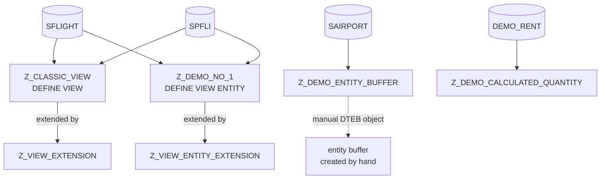

# New generation CDS views

Active contributors: Andre Fischer

## Purpose

`src/new_gen_cds_views/` holds the CDS sources from the session "A new generation of CDS views: CDS view entities". It contrasts the older CDS DDIC-based view (`DEFINE VIEW`) with the newer CDS view entity (`DEFINE VIEW ENTITY`) by putting nearly the same definition in both forms, plus an extension for each, a view entity prepared for entity buffering, and a calculated quantity example. There is no ABAP code; you inspect and activate the sources in ADT and use data preview.

The package has 19 files and six CDS data definitions (159 lines of CDS). It depends on SAP's flight demo tables and `DEMO_RENT`.

## Directory layout

```text
src/new_gen_cds_views/
├── package.devc.xml                          # empty file (0 bytes)
├── z_classic_view.ddls.*                     # CDS DDIC-based view with parameters
├── z_view_extension.ddls.*                   # EXTEND VIEW on z_classic_view
├── z_demo_no_1.ddls.*                        # CDS view entity, same shape as z_classic_view
├── z_view_entity_extension.ddls.*            # EXTEND VIEW ENTITY on z_demo_no_1
├── z_demo_entity_buffer.ddls.*               # view entity that allows an entity buffer
└── z_demo_calculated_quantity.ddls.*         # view entity with a calculated unit
```

Each definition has three files: `.asddls` (the source), `.ddls.xml` (name, description, source type), and `.ddls.baseinfo` (JSON list of the tables it selects from and associates to).

## Key abstractions

| Entity | File | Type | Reads from |
| --- | --- | --- | --- |
| `Z_CLASSIC_VIEW` | `src/new_gen_cds_views/z_classic_view.ddls.asddls` | DDIC-based view, SQL view `ZJIFFOIT` | `SFLIGHT` join `SPFLI`, association to `SCARR` |
| `Z_VIEW_EXTENSION` | `src/new_gen_cds_views/z_view_extension.ddls.asddls` | View extension, append view `ZERWEITERUNG` | extends `Z_CLASSIC_VIEW` |
| `Z_DEMO_NO_1` | `src/new_gen_cds_views/z_demo_no_1.ddls.asddls` | View entity | `SFLIGHT` join `SPFLI`, association to `SCARR` |
| `Z_VIEW_ENTITY_EXTENSION` | `src/new_gen_cds_views/z_view_entity_extension.ddls.asddls` | View entity extension | extends `Z_DEMO_NO_1` |
| `Z_DEMO_ENTITY_BUFFER` | `src/new_gen_cds_views/z_demo_entity_buffer.ddls.asddls` | View entity with `@AbapCatalog.entityBuffer.definitionAllowed: true` | `SAIRPORT` |
| `Z_DEMO_CALCULATED_QUANTITY` | `src/new_gen_cds_views/z_demo_calculated_quantity.ddls.asddls` | View entity | `DEMO_RENT` |

## How it works



### DDIC-based view versus view entity

`Z_CLASSIC_VIEW` and `Z_DEMO_NO_1` have the same three parameters (`p_carrid`, `p_abap_int4`, `p_abap_dec`), the same join, and the same association. The differences are the teaching point. In the classic view, features that the old syntax does not support are commented out with an explanation. In the view entity, the same lines are active.

| Topic | `Z_CLASSIC_VIEW` | `Z_DEMO_NO_1` |
| --- | --- | --- |
| Generated SQL view | Needs `@AbapCatalog.sqlViewName: 'ZJIFFOIT'` | Not required (line is commented out with "not required anymore") |
| Unknown annotation `@bla.blue` | Accepted ("valid in classic view") | Commented out as "Stricter check" |
| Client handling annotations | `@ClientHandling.type`, `@ClientHandling.algorithm: #SESSION_VARIABLE` | `@ClientHandling.algorithm` "not allowed" |
| Literal on left side of `ON` (`1 = 1`) | Commented out: "not possible in CDS View" | Active |
| Field prefix | `deptime` without alias ("no prefix required") | `b.deptime` ("prefix mandatory") |
| Session variables | `$session.user_date`, `$session.user_timezone` commented out | Active |
| `CASE` with `cast` and `substring` operands | Commented out | Active, produces `Airline` |
| `substring` on session variable and parameter | Commented out | Active |
| Nested `CASE` with `ELSE NULL` | Commented out | Active |
| Typed literals (`abap.dec'.15'`, `abap.d16n'123.45'`) | Commented out | Active in field list and `WHERE` |
| Expressions in `WHERE` (`b.distance * 5 = case ...`) | Commented out | Active |

Both files also keep two commented `WHERE` conditions marked "Stricter check" (`cast(111 as int1) = 256` and a `NUMC4` / `CHAR5` comparison) that neither view type accepts.

### Extensions

- `Z_VIEW_EXTENSION` uses `EXTEND VIEW z_classic_view WITH z_view_extension` and needs its own append view name (`@AbapCatalog.sqlViewAppendName: 'ZERWEITERUNG'`). It adds `_scarr` and `a.carrid as my_carrid`.
- `Z_VIEW_ENTITY_EXTENSION` is four lines: `extend view entity z_demo_no_1 with { _scarr }`. No annotations or append view are needed.

### Entity buffer

`Z_DEMO_ENTITY_BUFFER` selects `id`, `name`, and `time_zone` from `SAIRPORT` with both `id` and `name` as keys, and allows an entity buffer with `@AbapCatalog.entityBuffer.definitionAllowed: true`. The buffer itself is a separate object of type DTEB, which abapGit cannot serialize. `README.md` gives the source to paste when creating it by hand (`layer core`, `type generic number of key elements 1`). See [Getting started](../overview/getting-started.md).

### Calculated quantity

`Z_DEMO_CALCULATED_QUANTITY` divides `rent_decfloat34` by `apartment_size` and builds the unit as `concat( concat( currency, '/' ), apartment_unit )`. The result field is annotated `@Semantics.quantity.unitOfMeasure: 'calculatedUnit'`, so the calculated unit field is declared as the unit for the calculated quantity.

## Integration points

- Depends on SAP flight model tables `SFLIGHT`, `SPFLI`, `SCARR`, `SAIRPORT`, data element `S_CARR_ID`, and ABAP demo table `DEMO_RENT`. The `.ddls.baseinfo` files list these dependencies.
- `Z_DEMO_NO_1` and `Z_CLASSIC_VIEW` use `@AccessControl.authorizationCheck: #CHECK` but no access control (DCL) object is included, so activation probably shows a warning.
- No other package uses these entities.

## Key source files

| File | Purpose |
| --- | --- |
| `src/new_gen_cds_views/z_demo_no_1.ddls.asddls` | Main view entity demo with every new feature active |
| `src/new_gen_cds_views/z_classic_view.ddls.asddls` | Classic counterpart with unsupported lines commented out |
| `src/new_gen_cds_views/z_view_entity_extension.ddls.asddls` | Minimal view entity extension |
| `src/new_gen_cds_views/z_view_extension.ddls.asddls` | Classic view extension with append view name |
| `src/new_gen_cds_views/z_demo_entity_buffer.ddls.asddls` | Base for the hand-made entity buffer |
| `src/new_gen_cds_views/z_demo_calculated_quantity.ddls.asddls` | Calculated quantity with a computed unit |

## Entry points for modification

To show another difference between the two view types, add the line to `src/new_gen_cds_views/z_demo_no_1.ddls.asddls` and the commented version with a reason to `src/new_gen_cds_views/z_classic_view.ddls.asddls`, keeping the two files aligned. `src/new_gen_cds_views/package.devc.xml` is currently empty, so restore its contents (see [Cleanup opportunities](../cleanup-opportunities.md)) before relying on a package description.

## Related pages

- [Glossary](../overview/glossary.md) for CDS terms
- [Data models](../reference/data-models.md)
- [Lore](../lore.md) for the Jan 2023 upload that emptied and refilled these files
