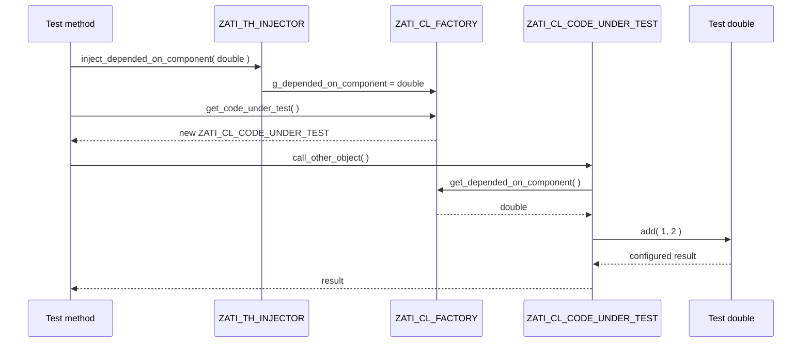

# Test isolation

Active contributors: Michael Sauter

## Purpose

`src/test_isolation/` holds the examples from "Why aren't my tests stable? Test isolation with the ABAP Unit framework", presented at DSAG and a global user group webinar. One class, `ZATI_CL_CODE_UNDER_TEST`, calls six different kinds of depended-on components. Its test include has one local test class per kind, and each test class isolates that dependency with a different technique or framework. It is the only package in the repository with automated tests.

The package has 17 files: 4 classes, 2 interfaces, and 1 CDS view entity, with 201 lines of production ABAP and CDS and 510 lines of test code. The package description is "Test Isolation Demo".

## Directory layout

```text
src/test_isolation/
├── package.devc.xml
├── zati_if_code_under_test.intf.abap            # interface of the CUT
├── zati_cl_code_under_test.clas.abap            # CUT: calls six kinds of DOCs
├── zati_cl_code_under_test.clas.testclasses.abap# 8 test classes + 2 test doubles
├── zati_if_depended_on_component.intf.abap      # add( ), subtract( )
├── zati_cl_depended_on_component.clas.abap      # real DOC; add( ) always fails
├── zati_cl_factory.clas.abap                    # creates CUT and DOC
├── zati_th_injector.clas.abap                   # test helper that injects doubles
└── zati_cds_entity.ddls.asddls                  # CDS view: item count per sales order
```

## Key abstractions

| Object | File | Role |
| --- | --- | --- |
| `ZATI_IF_CODE_UNDER_TEST` | `src/test_isolation/zati_if_code_under_test.intf.abap` | Six methods, one per DOC kind. Defines `t_items_per_sales_order` (hashed table of `ZATI_CDS_ENTITY`) and RAP response types for `/DMO/I_TRAVEL_M`. |
| `ZATI_CL_CODE_UNDER_TEST` | `src/test_isolation/zati_cl_code_under_test.clas.abap` | The CUT. `create private`, global friend `ZATI_CL_FACTORY`. |
| `ZATI_IF_DEPENDED_ON_COMPONENT` | `src/test_isolation/zati_if_depended_on_component.intf.abap` | `add( )` and `subtract( )`. |
| `ZATI_CL_DEPENDED_ON_COMPONENT` | `src/test_isolation/zati_cl_depended_on_component.clas.abap` | Real DOC. `add( )` is `assert 1 = 0`, so any test that does not replace it dumps. |
| `ZATI_CL_FACTORY` | `src/test_isolation/zati_cl_factory.clas.abap` | `get_code_under_test( )` and `get_depended_on_component( )` return the injected double if bound, else a new real instance. |
| `ZATI_TH_INJECTOR` | `src/test_isolation/zati_th_injector.clas.abap` | `for testing`, global friend of the factory. `inject_code_under_test( )`, `inject_depended_on_component( )`, `clear( )`. |
| `ZATI_CDS_ENTITY` | `src/test_isolation/zati_cds_entity.ddls.asddls` | `count(distinct so_item_key)` per `parent_key` from `DEMO_SALES_SO_I`. |

## How it works

### Dependency injection



Friendship enforces the pattern. Only the factory can create the CUT and DOC (both are `create private` with `global friends zati_cl_factory`), and only the injector can write the factory's private `g_*` attributes (`global friends zati_th_injector`). Because the injector is `for testing`, production code cannot inject anything.

### What the CUT calls and how each test isolates it

The table below follows `README.md` and the test include `src/test_isolation/zati_cl_code_under_test.clas.testclasses.abap`.

| CUT method | Dependency | Test class | Isolation technique |
| --- | --- | --- | --- |
| `call_other_object` | `ZATI_IF_DEPENDED_ON_COMPONENT~add` | `ltc_call_other_object` | Hand-written double `ltd_depended_on_component` (`partially implemented`) injected with `ZATI_TH_INJECTOR` |
| `call_other_object` | same | `ltc_call_other_object_fw` | `cl_abap_testdouble=>create( )` and `configure_call( )->returning( 1 )` (ABAP OO Test Double Framework) |
| `call_function_module` | `POPUP_TO_CONFIRM` | `ltc_call_function_module` | `cl_function_test_environment=>create( )` with configured `ANSWER` values `1`, `2`, `'A'` |
| `select_database_table` | table `DEMO_SALES_SO_I` | `ltc_select_database_table` | `cl_osql_test_environment=>create( )` (ABAP SQL Test Double Framework) with five inserted rows, plus an empty-table test |
| `select_cds_entity` | CDS entity `ZATI_CDS_ENTITY` | `ltc_select_cds_entity` | `cl_cds_test_environment=>create( 'ZATI_CDS_ENTITY' )` (CDS Test Double Framework), same data and assertions |
| `call_authority_check` | `AUTHORITY-CHECK` on `S_DEVELOP`, `ACTVT = '02'` | `ltc_call_authority_check` | `cl_aunit_authority_check` restricts the user to `ACTVT 03` (expect `sy-subrc = 4`) or `02` (expect `0`) |
| `call_rap_business_object` | `MODIFY ENTITIES OF /dmo/i_travel_m` | `ltcl_call_rap_bo_tx_bf_dbl` | Transactional buffer double (`cl_botd_txbufdbl_bo_test_env`) with field handler `ltd_fields_handler` that assigns travel IDs on create |
| `call_rap_business_object` | same | `ltcl_call_rap_bo_mock_eml_api` | Mock EML API (`cl_botd_mockemlapi_bo_test_env`) configured to return a `mapped` travel row |

`README.md` lists the first release for several frameworks: OO test doubles in SAP BASIS 740 SP9, CDS test doubles in NetWeaver 751, SQL test doubles in 752, function module test doubles in 756.

All test classes are `duration short risk level harmless`. Each sets up the framework environment once in `class_setup`, clears doubles in `setup`, and destroys the environment in `class_teardown` where the framework requires it.

## Integration points

- SAP objects needed: `DEMO_SALES_SO_I`, `POPUP_TO_CONFIRM`, authorization object `S_DEVELOP`, and RAP BO `/DMO/I_TRAVEL_M` (from the ABAP Flight Reference Scenario).
- Test frameworks: `CL_ABAP_TESTDOUBLE`, `CL_FUNCTION_TEST_ENVIRONMENT`, `CL_OSQL_TEST_ENVIRONMENT`, `CL_CDS_TEST_ENVIRONMENT`, `CL_AUNIT_AUTHORITY_CHECK`, `CL_BOTD_TXBUFDBL_BO_TEST_ENV`, `CL_BOTD_MOCKEMLAPI_BO_TEST_ENV`, `CL_ABAP_UNIT_ASSERT`.
- Nothing outside the package references these objects.

## Key source files

| File | Purpose |
| --- | --- |
| `src/test_isolation/zati_cl_code_under_test.clas.testclasses.abap` | All tests and local doubles; the core of the demo |
| `src/test_isolation/zati_cl_code_under_test.clas.abap` | The six dependency calls |
| `src/test_isolation/zati_cl_factory.clas.abap` | Lazy creation with injectable overrides |
| `src/test_isolation/zati_th_injector.clas.abap` | Test-only seam into the factory |
| `src/test_isolation/zati_cl_depended_on_component.clas.abap` | Real DOC that fails on `add( )` |
| `src/test_isolation/zati_cds_entity.ddls.asddls` | CDS entity doubled by `ltc_select_cds_entity` |

## Entry points for modification

`README.md` says the folder "will be also enhanced once there are new test frameworks available". To add one, add a method to `src/test_isolation/zati_if_code_under_test.intf.abap`, implement the dependency call in `src/test_isolation/zati_cl_code_under_test.clas.abap`, add a new `ltc_` class to the test include, and add a row to the table in `README.md`.

## Related pages

- [Testing](../how-to-contribute/testing.md)
- [Patterns and conventions](../how-to-contribute/patterns-and-conventions.md)
- [Lore](../lore.md) for the `ZMS` to `ZATI` rename
