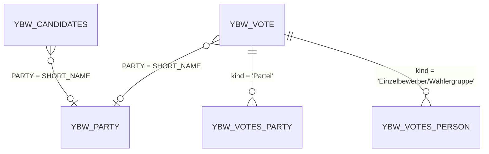

# Data models

Every DDIC object and CDS entity defined in this repository, taken from the abapGit XML and DDL files. SAP-delivered tables that the demos read (flight model, demo tables, RAP BO) are listed on [Dependencies](dependencies.md).

## Election tables (`src/art_data_access/`)

All are client-independent transparent tables (no `CLIENT` field) with delivery class `L`.

### `YBW_VOTE`

File: `src/art_data_access/ybw_vote.tabl.xml`. Description: "result of the Bundestagswahl 2021". Not buffered.

| Field | Key | Type | Description |
| --- | --- | --- | --- |
| `AREA` | yes | `YBW_D_AREA_NAME` (CHAR 200) | Area name |
| `VOTE` | yes | CHAR 1 | Stimme (first or second vote) |
| `SUBID` | yes | INT4 | Gruppenreihenfolge (group order) |
| `KIND` | | CHAR 40 | Gruppenart (group kind, for example `Partei`) |
| `PARTY` | | `YBW_D_PARTY` (CHAR 150) | Party or candidate group |
| `VOTES` | | INT8 | Anzahl Stimmen (number of votes) |

### `YBW_PARTY`

File: `src/art_data_access/ybw_party.tabl.xml`. Description: "German groups / parties attending the election". Fully buffered (`PUFFERUNG = X`, `BUFALLOW = X`). Secondary index `SHO` on `KIND`.

| Field | Key | Type |
| --- | --- | --- |
| `ID` | yes | INT2 |
| `KIND` | | CHAR 14 |
| `SHORT_NAME` | | `YBW_D_PARTY` (CHAR 150) |
| `LONG_NAME` | | CHAR 250 |

### `YBW_CANDIDATES`

File: `src/art_data_access/ybw_candidates.tabl.xml`. Description: "Candidates of the Bundestagswahl". Not buffered.

| Field | Key | Type |
| --- | --- | --- |
| `VOTING_DATE` | yes | DATN |
| `LASTNAME` | yes | CHAR 50 |
| `FIRSTNAME` | yes | CHAR 50 |
| `TITLE` | | CHAR 20 |
| `ADDITION` | | CHAR 20 |
| `GENDER` | | CHAR 1 |
| `BIRTHYEAR` | | INT2 |
| `POSTCODE` | | INT4 |
| `RESIDENCE` | | CHAR 100 |
| `BIRTHPLACE` | | CHAR 100 |
| `PROFESSION` | | CHAR 250 |
| `PROFESSION_KEY` | | INT1 |
| `AREA_CODE` | | INT2 |
| `AREA_NAME` | | `YBW_D_AREA_NAME` (CHAR 200) |
| `PARTY` | | `YBW_D_PARTY` (CHAR 150) |

### `YBW_INFRA`

File: `src/art_data_access/ybw_infra.tabl.xml`. Description: "Structural data of germany". 26 fields keyed by `LAND` and `VOTE_AREA_NUMBER` (Wahlkreis-Nr., constituency number). The other fields hold 2019 and 2020 statistics per constituency: `VOTE_AREA`, `VILLAGE`, `AREA_SQUARE_KM`, population counts and shares, age band percentages (`AGE_LT_18_PCT` to `AGE_GE_75_PCT`), land use, car ownership (`CARS_ALL_PER_1K_INHABITANTS`, `CARS_E_OR_HYBRID_PCT`), and school-leaver statistics (`FINISHER_*`). No loader fills it.

### Data elements

| Data element | File | Type | Label |
| --- | --- | --- | --- |
| `YBW_D_AREA_NAME` | `src/art_data_access/ybw_d_area_name.dtel.xml` | CHAR 200 | Gebietsname / Name of area |
| `YBW_D_PARTY` | `src/art_data_access/ybw_d_party.dtel.xml` | CHAR 150 | political party / Political Party |

### Relationships

These joins exist only in the demo queries; there are no foreign keys or CDS associations between the tables.

## Char-to-numc tables (`src/art_data_access/`)

Client-dependent tables used by `YBW_CHAR_TO_NUMC_1` to `_6`.

| Table | File | Fields | Notes |
| --- | --- | --- | --- |
| `YDEMOS4_CHAR10` | `src/art_data_access/ydemos4_char10.tabl.xml` | `CLIENT` (key), `K1` CHAR 10 (key), `F_CHAR10` CHAR 10 | Delivery class `A` |
| `YDEMOS4_NUMC10` | `src/art_data_access/ydemos4_numc10.tabl.xml` | `CLIENT` (key), `K1` CHAR 10 (key), `F_NUMC10` NUMC 10 | Delivery class `A` |
| `YDEMOS4_NUMC10_G` | `src/art_data_access/ydemos4_numc10_g.tabl.xml` | same as `YDEMOS4_NUMC10` | Global temporary table (`IS_GTT = X`) |

## CDS entities

| Entity | File | Kind | Source | Fields |
| --- | --- | --- | --- | --- |
| `YBW_VOTES_PARTY` | `src/art_data_access/ybw_votes_party.ddls.asddls` | View entity | `YBW_VOTE` where `kind = 'Partei'` | `Area`, `Vote`, `Subid` (keys), `Party`, `Votes` |
| `YBW_VOTES_PERSON` | `src/art_data_access/ybw_votes_person.ddls.asddls` | View entity | `YBW_VOTE` where kind is `Einzelbewerber/Wählergruppe` and party is not | same as above |
| `Z_CLASSIC_VIEW` | `src/new_gen_cds_views/z_classic_view.ddls.asddls` | DDIC-based view (`ZJIFFOIT`), parameters | `SFLIGHT` join `SPFLI`, assoc. `_scarr` | `carrid`, `CarridCamelCase` (keys), `deptime`, `param_carrid` |
| `Z_VIEW_EXTENSION` | `src/new_gen_cds_views/z_view_extension.ddls.asddls` | View extension (`ZERWEITERUNG`) | extends `Z_CLASSIC_VIEW` | adds `_scarr`, `my_carrid` |
| `Z_DEMO_NO_1` | `src/new_gen_cds_views/z_demo_no_1.ddls.asddls` | View entity, parameters | `SFLIGHT` join `SPFLI`, assoc. `_scarr` | `carrid`, `connid` (keys), `deptime`, `param_carrid`, `session_user_date`, `sessionTime`, `Airline`, `func_session_timezone`, `Arith_on_left_side_of_case`, `dec_literal` |
| `Z_VIEW_ENTITY_EXTENSION` | `src/new_gen_cds_views/z_view_entity_extension.ddls.asddls` | View entity extension | extends `Z_DEMO_NO_1` | adds `_scarr` |
| `Z_DEMO_ENTITY_BUFFER` | `src/new_gen_cds_views/z_demo_entity_buffer.ddls.asddls` | View entity, entity buffer allowed | `SAIRPORT` | `Id`, `Name` (keys), `Time_Zone` |
| `Z_DEMO_CALCULATED_QUANTITY` | `src/new_gen_cds_views/z_demo_calculated_quantity.ddls.asddls` | View entity | `DEMO_RENT` | `ApartmentId` (key), `ApartmentSize`, `ApartmentUnit`, `Currency`, `rent_per_size`, `calculatedUnit` |
| `ZATI_CDS_ENTITY` | `src/test_isolation/zati_cds_entity.ddls.asddls` | View entity, aggregated | `DEMO_SALES_SO_I` grouped by `parent_key` | `SalesOrder` (key), `ItemCount` |

The parameters of `Z_CLASSIC_VIEW` and `Z_DEMO_NO_1` are `p_carrid : s_carr_id`, `p_abap_int4 : abap.int4`, and `p_abap_dec : abap.dec( 8, 2 )`.

## Internal table types (`src/itab_news/`)

| Object | File | Definition |
| --- | --- | --- |
| `ZDEMO_ITAB_ORDER` | `src/itab_news/zdemo_itab_order.tabl.xml` | Structure (`TABCLASS = INTTAB`): `ORDER`, `COUNT`, `SUPPL_ID`, `SUPPL_ITEM`, `CUSTOMER` (INT4), `DESCRIPTION` (CHAR 100) |
| `ZDEMO_ITAB_ORDER_TAB` | `src/itab_news/zdemo_itab_order_tab.ttyp.xml` | Standard table of `ZDEMO_ITAB_ORDER`, non-unique primary key on `ORDER` |
| `ZDEMO_ITAB_ORDER_TAB_OPT` | `src/itab_news/zdemo_itab_order_tab_opt.ttyp.xml` | Same, plus secondary key `CUST` on `CUSTOMER` |

## Types declared in ABAP

| Type | File | Definition |
| --- | --- | --- |
| `ZATI_IF_CODE_UNDER_TEST=>T_ITEMS_PER_SALES_ORDER` | `src/test_isolation/zati_if_code_under_test.intf.abap` | Hashed table of `ZATI_CDS_ENTITY` with unique key `salesorder` |
| `ZATI_IF_CODE_UNDER_TEST=>T_FAILED`, `T_REPORTED`, `T_MAPPED` | same | `response for failed / reported / mapped /dmo/i_travel_m` |
| `YBW_WINDOWING_ABAP=>TT_AGGREGATED_VOTES` | `src/art_data_access/ybw_windowing_abap.clas.abap` | Table of `area`, `party`, `votes` (INT8), `overall_votes` (INT8) |
| `YBW_INTERSECT=>TT_INTERSECT` | `src/art_data_access/ybw_intersect.clas.abap` | Table of `partei` (`YBW_VOTE-PARTY`) |
| `ZCL_DEMO_ITAB_KEY_ALIAS_1=>TT_ITEM` | `src/itab_news/zcl_demo_itab_key_alias_1.clas.abap` | Sorted table, unique key `item_int`, non-unique sorted key `k1` on `suppl_id`, `suppl_item` |

## Related pages

- [Election dataset](../features/election-dataset.md)
- [Dependencies](dependencies.md)
